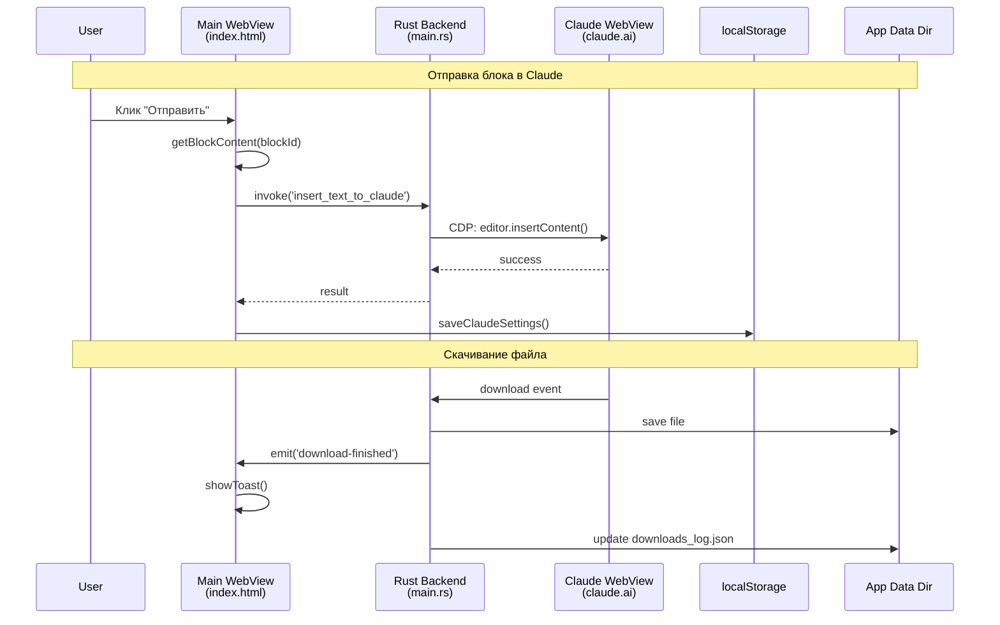

# Обзор архитектуры

[← Назад к INDEX](INDEX.md)

## Технологии

| Компонент | Технология |
|-----------|------------|
| **Frontend** | Vanilla JS (модульная структура), TailwindCSS (CDN) |
| **Backend** | Rust, Tauri 2.0 |
| **Platform** | Windows (WebView2) |
| **Режим работы** | Только онлайн |

## Структура проекта

```
ai-prompts-manager/
├── dist/                       # Frontend
│   ├── index.html              # HTML + минимальный JS (~1050 строк)
│   ├── toolbar.html            # Тулбар над Claude (~123 строки)
│   ├── downloads.html          # Менеджер загрузок (~590 строк)
│   ├── css/
│   │   └── styles.css          # Стили (~3700 строк)
│   └── js/                     # JavaScript модули (35 файлов)
│
├── src-tauri/                  # Backend (Rust)
│   ├── src/                    # Модульная структура (20 файлов)
│   │   ├── main.rs             # Точка входа (~131 строка)
│   │   ├── lib.rs              # Реэкспорт модулей
│   │   ├── types.rs            # Структуры данных
│   │   ├── state.rs            # Глобальные состояния
│   │   ├── commands/           # Tauri команды (6 файлов, 45 команд)
│   │   ├── downloads/          # Логика загрузок
│   │   ├── utils/              # Утилиты (MIME, платформа, размеры)
│   │   └── webview/            # Управление WebView
│   ├── scripts/
│   │   └── claude_helpers.js   # Инжектируемый скрипт для Claude WebView (~310 строк)
│   ├── tauri.conf.json         # Конфигурация Tauri
│   ├── Cargo.toml              # Зависимости Rust
│   └── capabilities/           # Permissions
│
├── prompts/                    # Вкладки с промптами (создаётся при push через project-manager.py)
│   ├── manifest.json           # Манифест вкладок с версиями
│   └── *.json                  # JSON файлы вкладок
│
├── docs/                       # Документация
├── project-manager/            # CLI управления
│   └── project-manager.py      # Скрипт управления промптами и релизами
├── tests/                      # Unit-тесты (Jest)
└── .github/workflows/          # CI/CD

> **Примечание:** Приватный ключ подписи (`TAURI_SIGNING_PRIVATE_KEY`) хранится в GitHub Secrets. Публичный ключ встроен в `tauri.conf.json`.
```

## Multi-WebView архитектура

```
┌─────────────────────────────────────────────────┐
│                  Main Window                     │
├───────────────────┬─────────────────────────────┤
│                   │                             │
│   Main WebView    │   Claude WebView (Tab 1-3) │
│   (UI приложения) │   (claude.ai)              │
│                   │                             │
│   - index.html    ├─────────────────────────────┤
│   - JS модули     │   Toolbar WebView          │
│                   │   (toolbar.html)           │
│                   ├─────────────────────────────┤
│                   │   Downloads WebView        │
│                   │   (downloads.html)         │
│                   │                             │
└───────────────────┴─────────────────────────────┘
```

### WebView компоненты

| WebView | Файл | Описание |
|---------|------|----------|
| Main | `index.html` | UI приложения, workflow редактор |
| Claude (1-3) | claude.ai | Три независимых чата Claude |
| Toolbar | `toolbar.html` | Переключатель табов, кнопка загрузок |
| Downloads | `downloads.html` | Менеджер скачанных файлов |

### Z-Order WebView

При создании нового Claude WebView вызывается `recreate_toolbar()`:
1. Закрывает toolbar и downloads webview
2. Пересоздаёт их — теперь они поверх Claude

## Дополнительные WebView

### toolbar.html (~123 строки)

Плавающий тулбар над Claude WebView:
- Кнопки переключения вкладок Claude (1/2/3)
- Кнопка менеджера загрузок
- Позиционируется внизу Claude WebView

### downloads.html (~590 строк)

Менеджер загрузок — popup для управления скачанными файлами:

| Функция | Описание |
|---------|----------|
| Список загрузок | Имя файла, дата, кнопки действий |
| Multi-select | Shift+click для выбора диапазона |
| Открыть файл | Клик по имени файла |
| Отправить в Claude | Одиночная или множественная отправка |
| Удалить | Удаление записи из лога |
| Auto-cleanup | Автоудаление записей для несуществующих файлов |

## Полный поток данных



---

## Debug Mode

```javascript
const DEBUG = false;  // config.js

function log(...args) {
    if (DEBUG) console.log('[APM]', ...args);
}
```

Включение: установить `DEBUG = true` в `dist/js/config.js` для детального логирования.

## Связанные документы

- [02-FRONTEND.md](02-FRONTEND.md) — JavaScript модули
- [03-BACKEND.md](03-BACKEND.md) — Rust backend
- [04-CLAUDE.md](04-CLAUDE.md) — Интеграция с Claude
