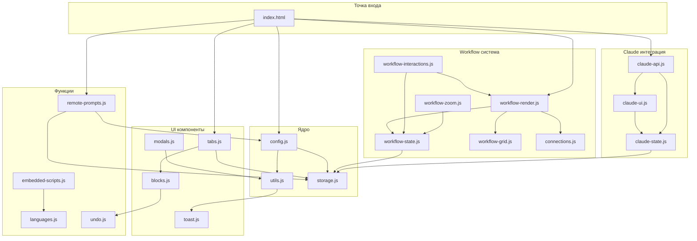

# Frontend — JavaScript модули

[← Назад к INDEX](INDEX.md)

## Навигация по подмодулям

| Документ | Строк | Описание |
|----------|-------|----------|
| [Структуры данных](frontend/DATA-STRUCTURES.md) | ~80 | Tab, Block, Workflow State, Claude Settings |
| [Утилиты](frontend/UTILS.md) | ~200 | config, utils, toast, storage, modals |
| [Вкладки и блоки](frontend/TABS-BLOCKS.md) | ~180 | tabs.js, blocks.js, undo.js |
| [Workflow](frontend/WORKFLOW.md) | ~200 | state, grid, zoom, interactions, render, connections |
| [Claude API](frontend/CLAUDE-API.md) | ~200 | claude-state, claude-ui, claude-api |
| [Скрипты и языки](frontend/EMBEDDED-SCRIPTS.md) | ~200 | embedded-scripts, languages |
| [index.html](frontend/INDEX-HTML.md) | ~300 | Каталог функций приложения |
| [Frontend API](frontend/INDEX-HTML-API.md) | ~400 | API reference (функции по модулям) |
| [AppState](frontend/APPSTATE.md) | ~100 | Shared State, алиасы |

## Обзор модулей

| Категория | Модули | Функций |
|-----------|--------|---------|
| Ядро | config.js, app-state.js, utils.js, toast.js, storage.js, modals.js, dropdown.js | ~35 |
| Языки/скрипты | languages.js, language-ui.js, embedded-scripts.js, embedded-scripts-spellcheck.js | ~25 |
| Вкладки/блоки | tabs.js, tab-selector.js, blocks.js, block-ui.js, undo.js | ~40 |
| Данные | persistence.js, export-import.js, remote-prompts.js | ~20 |
| UI | settings.js, updates.js, context-menu.js, dynamic-input.js, edit-helpers.js, attachments.js | ~50 |
| Workflow | workflow-state.js, workflow-grid.js, workflow-zoom.js, workflow-render.js, workflow-interactions.js, connections.js | ~40 |
| Claude | claude-state.js, claude-ui.js, claude-api.js | ~45 (5+5+35) |
| Инициализация | init.js | ~30 |
| **Всего** | **35 файлов** | **~289** |

> **Примечание:** Число ~289 включает все функции (публичные API + внутренние helpers). Публичных API функций около 94 — см. [INDEX-HTML-API.md](frontend/INDEX-HTML-API.md).

## Быстрый доступ

### Как работать с вкладками?

```javascript
// Создать вкладку
const newTab = createNewTab('My Prompts');

// Получить блоки
const blocks = getTabBlocks('my-prompts');
```

→ [Подробнее](frontend/TABS-BLOCKS.md)

### Как работать с workflow?

```javascript
// Перерендерить
renderWorkflow();

// Добавить связь
addConnection('block-1', 'right', 'block-2', 'left');

// Сохранить состояние
saveWorkflowState();
```

→ [Подробнее](frontend/WORKFLOW.md)

### Как работать с Claude?

```javascript
// Отправить блок
await sendNodeToClaude(0, 1);

// Создать проект
const project = await createProjectViaAPI(1);

// Показать/скрыть панель
await toggleClaude();
```

→ [Подробнее](frontend/CLAUDE-API.md)

### Как работать с AppState?

```javascript
// Через алиасы
currentTab = 'my-tab';
isEditMode = true;

// Напрямую
window.AppState.workflow.zoom = 0.8;
```

→ [Подробнее](frontend/APPSTATE.md)

## Связанные документы

- [03-BACKEND.md](03-BACKEND.md) — Tauri commands
- [04-CLAUDE.md](04-CLAUDE.md) — Интеграция с Claude
- [05-FEATURES.md](05-FEATURES.md) — Функции приложения

---

## Схема зависимостей модулей



### Порядок загрузки модулей

```html
<!-- 1. Ядро -->
<script src="js/config.js"></script>
<script src="js/app-state.js"></script>
<script src="js/remote-prompts.js"></script>
<script src="js/languages.js"></script>
<script src="js/language-ui.js"></script>
<script src="js/embedded-scripts.js"></script>
<script src="js/embedded-scripts-spellcheck.js"></script>
<script src="js/utils.js"></script>
<script src="js/toast.js"></script>
<script src="js/storage.js"></script>
<script src="js/modals.js"></script>

<!-- 2. UI компоненты -->
<script src="js/undo.js"></script>
<script src="js/tabs.js"></script>
<script src="js/dropdown.js"></script>
<script src="js/tab-selector.js"></script>
<script src="js/blocks.js"></script>
<script src="js/block-ui.js"></script>
<script src="js/attachments.js"></script>
<script src="js/updates.js"></script>
<script src="js/export-import.js"></script>
<script src="js/settings.js"></script>
<script src="js/context-menu.js"></script>
<script src="js/dynamic-input.js"></script>
<script src="js/persistence.js"></script>
<script src="js/edit-helpers.js"></script>

<!-- 3. Workflow -->
<script src="js/workflow-state.js"></script>
<script src="js/workflow-grid.js"></script>
<script src="js/workflow-zoom.js"></script>
<script src="js/connections.js"></script>
<script src="js/workflow-interactions.js"></script>
<script src="js/workflow-render.js"></script>

<!-- 4. Claude -->
<script src="js/claude-state.js"></script>
<script src="js/claude-ui.js"></script>
<script src="js/claude-api.js"></script>

<!-- 5. Инициализация (последним) -->
<script src="js/init.js"></script>
```

### Ключевые зависимости

| Модуль | Зависит от | Используется в |
|--------|------------|----------------|
| `config.js` | — | Все модули |
| `storage.js` | config | tabs, workflow-state, claude-state |
| `workflow-render.js` | state, grid, connections | index.html, interactions |
| `claude-api.js` | state, ui | index.html |
| `remote-prompts.js` | config, storage | index.html |
