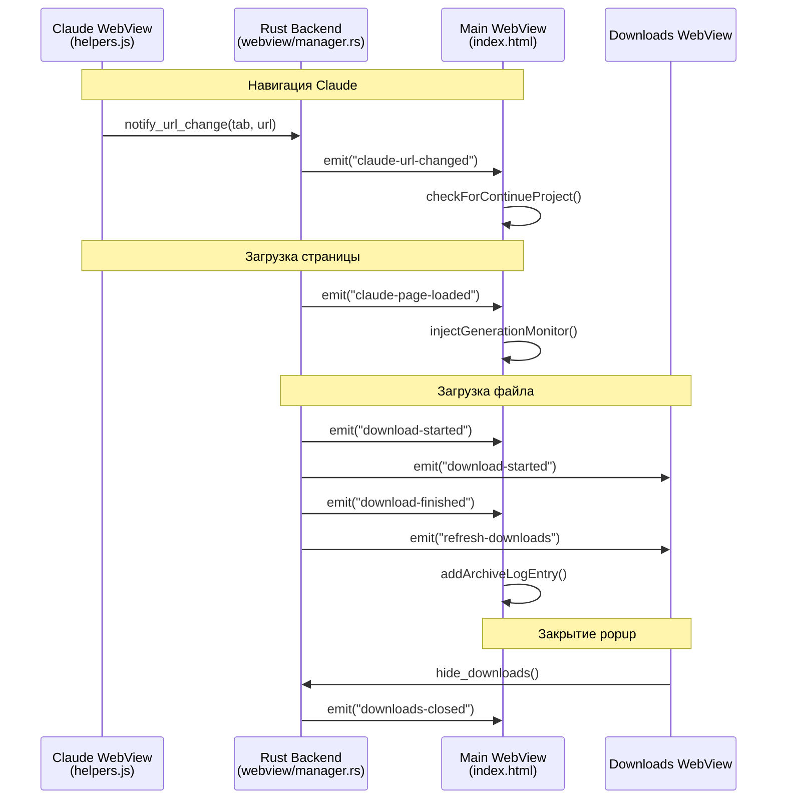

# Backend — Rust и Tauri

[← Назад к INDEX](INDEX.md)

## Модульная архитектура

Backend разбит на модули по функциональности:

```
src-tauri/src/
├── main.rs              (131 строк)  — точка входа, Tauri Builder
├── lib.rs               (23 строки)  — реэкспорт модулей
├── types.rs             (57 строк)   — структуры данных
├── state.rs             (31 строка)  — глобальные состояния
├── commands/            (45 команд)  — Tauri команды
│   ├── mod.rs           — реэкспорт
│   ├── app.rs           — управление приложением
│   ├── claude.rs        — взаимодействие с Claude
│   ├── toolbar.rs       — навигация и тулбар
│   ├── downloads.rs     — управление загрузками
│   ├── logs.rs          — работа с логами
│   └── attachments.rs   — аттачменты
├── downloads/           — логика загрузок
│   ├── mod.rs
│   └── paths.rs         — пути к файлам
├── utils/               — утилиты
│   ├── mod.rs
│   ├── mime.rs          — MIME-типы
│   ├── platform.rs      — платформо-зависимые
│   └── dimensions.rs    — константы и размеры
└── webview/             — управление WebView
    ├── mod.rs
    ├── scripts.rs       — JS скрипты для инжекции
    └── manager.rs       — создание и resize webview
```

### Основные модули

| Модуль | Описание |
|--------|----------|
| `types` | Структуры: `ArchiveLogEntry`, `DownloadEntry`, `DownloadsSettings`, `FileData` |
| `state` | Глобальные: `CLAUDE_VISIBLE`, `ACTIVE_TAB`, `PANEL_RATIO`, Mutex locks |
| `commands` | 45 Tauri команд, разбитых по доменам |
| `downloads` | Пути к логам, настройкам, генерация уникальных имён |
| `utils` | MIME-типы, платформо-зависимые функции, константы |
| `webview` | JS скрипты, создание/resize webview, обработка загрузок |

---

## Полный список Tauri Commands

Всего **45 команд**. Вызов из JS: `window.__TAURI__.core.invoke('command', { params })`

### Downloads & Files (`commands/downloads.rs`)

| Команда | Параметры | Возврат | Описание |
|---------|-----------|---------|----------|
| `get_downloads_path` | — | `String` | Путь загрузок |
| `set_downloads_path` | `path` | — | Установить путь |
| `pick_downloads_folder` | — | `String` | Диалог выбора |
| `open_file` | `file_path` | — | Открыть в системе |
| `delete_download` | `file_path` | `bool` | Удалить |
| `delete_all_downloads` | — | `u32` | Очистить все |

### Logs (`commands/logs.rs`)

| Команда | Параметры | Возврат | Описание |
|---------|-----------|---------|----------|
| `get_downloads_log` | — | `Vec<DownloadEntry>` | Лог (auto-cleanup) |
| `add_download_entry` | `filename, file_path` | — | Добавить запись |
| `get_archive_log` | — | `Vec<ArchiveLogEntry>` | Лог архивов |
| `add_archive_log_entry` | `tab, filename, claudeUrl, filePath?` | — | Добавить |
| `clear_archive_log` | — | — | Очистить |

### Attachments (`commands/attachments.rs`)

| Команда | Параметры | Возврат | Описание |
|---------|-----------|---------|----------|
| `read_file_for_attachment` | `path` | `FileData` | Читать для вложения |
| `write_temp_file` | `filename, content` | `String` | Записать temp |
| `attach_file_to_claude` | `tab, path` | — | Прикрепить файл |

### Claude WebView (`commands/claude.rs`)

| Команда | Параметры | Возврат | Описание |
|---------|-----------|---------|----------|
| `preload_claude` | — | — | Предзагрузка (устаревшее, табы создаются при старте) |
| `toggle_claude` | — | `bool` | Показать/скрыть |
| `get_active_tab` | — | `u8` | Активный таб |
| `switch_claude_tab` | `tab` | — | Переключить (навигирует на claude.ai если about:blank) |
| `switch_claude_tab_with_url` | `tab, url` | — | С навигацией |
| `get_tab_url` | `tab` | `String` | URL таба |
| `get_claude_state` | — | `(bool, u8, Vec<u8>)` | visible, active, tabs |
| `new_chat_in_tab` | `tab` | — | Новый чат |
| `reload_claude_tab` | `tab` | — | Перезагрузить страницу |
| `recreate_claude_tab` | `tab` | — | Пересоздать webview (для зависших табов) |
| `navigate_claude_tab` | `tab, url` | — | Навигация |
| `notify_url_change` | `tab, url` | — | От helpers.js |
| `close_claude_tab` | `tab` | `u8` | Закрыть (не используется) |
| `reset_claude_state` | — | — | Сбросить |

### Claude Interaction (`commands/claude.rs`)

| Команда | Параметры | Возврат | Описание |
|---------|-----------|---------|----------|
| `eval_in_claude` | `tab, script` | — | JS fire-and-forget |
| `eval_in_claude_with_result` | `tab, script, timeout?` | `String` | JS с результатом (CDP) |
| `insert_text_to_claude` | `tab, text, autoSend` | — | Вставить текст |
| `inject_generation_monitor` | `tab` | — | Мониторинг генерации |
| `check_generation_status` | `tab` | `bool` | Статус генерации |

### Panel & Window (`commands/claude.rs`, `commands/app.rs`)

| Команда | Параметры | Возврат | Описание |
|---------|-----------|---------|----------|
| `set_panel_ratio` | `ratio` | — | Соотношение (35-65) |
| `get_panel_ratio` | — | `u32` | Получить |
| `get_window_width` | — | `f64` | Ширина окна |
| `set_window_background` | `r, g, b` | — | Цвет фона |

### Toolbar (`commands/toolbar.rs`)

| Команда | Параметры | Возврат | Описание |
|---------|-----------|---------|----------|
| `toolbar_back` | — | — | Назад |
| `toolbar_forward` | — | — | Вперёд |
| `toolbar_reload` | — | — | Перезагрузить |
| `show_downloads` | — | — | Показать менеджер |
| `hide_downloads` | — | — | Скрыть |
| `forward_scroll` | `delta_y` | — | Проброс скролла |
| `forward_click` | `x, y` | — | Проброс клика |

### App (`commands/app.rs`)

| Команда | Параметры | Возврат | Описание |
|---------|-----------|---------|----------|
| `reset_app_data` | — | — | Сброс данных |
| `open_app_data_dir` | — | — | Открыть папку |

---

## Ключевые функции по модулям

### webview/manager.rs

| Функция | Описание |
|---------|----------|
| `ensure_claude_webview(app, tab, url)` | Создание Claude WebView с обработчиками |
| `ensure_toolbar(app)` | Создание toolbar и downloads popup |
| `recreate_toolbar(app)` | Пересоздание для z-order |
| `resize_webviews(app)` | Обновление размеров и позиций |

### webview/scripts.rs

| Функция/Константа | Описание |
|-------------------|----------|
| `CLAUDE_HELPERS_JS` | JS helpers из `scripts/claude_helpers.js` |
| `CLAUDE_SELECTORS_JSON` | Селекторы из `scripts/selectors.json` |
| `get_claude_init_script(tab)` | Генерация init script для таба |
| `get_generation_monitor_script()` | Скрипт мониторинга генерации |
| `get_scroll_script(delta_y)` | Скрипт для скролла |
| `get_click_script(x, y)` | Скрипт для клика |

### downloads/paths.rs

| Функция | Описание |
|---------|----------|
| `get_app_data_dir()` | Путь к папке данных приложения |
| `get_archive_log_path()` | Путь к `archive_log.json` |
| `get_downloads_log_path()` | Путь к `downloads_log.json` |
| `get_downloads_settings_path()` | Путь к `downloads_settings.json` |
| `get_custom_downloads_path()` | Чтение кастомного пути |
| `save_custom_downloads_path(path)` | Сохранение кастомного пути |
| `get_unique_filepath(dir, filename)` | Генерация уникального имени |

### utils/

| Модуль | Функции |
|--------|---------|
| `mime.rs` | `get_mime_type(extension)` — определение MIME-типа |
| `platform.rs` | `set_window_icon_from_exe()`, `open_file_in_system()`, `open_directory_in_system()` |
| `dimensions.rs` | `get_dimensions(app)`, константы `animation::*`, `sizes::*`, `limits::*` |

---

## Tauri Events

События для коммуникации между Rust и JavaScript.

### Диаграмма потока событий



### Полный список событий

| Событие | Направление | Payload | Описание |
|---------|-------------|---------|----------|
| `claude-page-loaded` | Rust → JS | `{tab: number}` | Страница Claude загружена |
| `claude-navigation-started` | Rust → JS | `{tab: number, url: string}` | Начало навигации |
| `claude-url-changed` | Rust → JS | `{tab: number, url: string}` | URL изменился |
| `download-started` | Rust → JS | `string` (filename) | Начало загрузки |
| `download-finished` | Rust → JS | `{filename, tab, url, file_path}` | Загрузка завершена |
| `download-failed` | Rust → JS | `string` (filename) | Ошибка загрузки |
| `refresh-downloads` | Rust → JS | `()` | Обновить список |
| `downloads-closed` | Rust → JS | `()` | Popup закрыт |

---

## Synchronization & Thread Safety

### Mutex Guards (`state.rs`)

| Mutex | Назначение |
|-------|------------|
| `WEBVIEW_CREATION_LOCK` | Защита от параллельного создания webview |
| `DOWNLOADS_LOG_LOCK` | Синхронизация записи в downloads_log.json |
| `ARCHIVE_LOG_LOCK` | Синхронизация записи в archive_log.json |

```rust
// Пример использования (webview/manager.rs)
fn ensure_claude_webview(...) -> Result<(), String> {
    let _guard = WEBVIEW_CREATION_LOCK.lock()
        .map_err(|_| "Lock poisoned")?;
    
    if app.get_webview(&label).is_some() {
        return Ok(()); // Double-check под локом
    }
    // ... создание webview
}
```

---

## Константы (`utils/dimensions.rs`)

### Анимация

| Константа | Значение | Описание |
|-----------|----------|----------|
| `ANIMATION_STEPS` | 8 | Шагов анимации панели |
| `ANIMATION_DELAY_MS` | 20 | Задержка между шагами |

### Размеры UI

| Константа | Значение | Описание |
|-----------|----------|----------|
| `TOOLBAR_WIDTH` | 152.0 | Ширина тулбара |
| `TOOLBAR_HEIGHT` | 44.0 | Высота тулбара |
| `TOOLBAR_BOTTOM_OFFSET` | 10.0 | Отступ от низа |
| `DOWNLOADS_WIDTH` | 320.0 | Ширина popup |
| `DOWNLOADS_HEIGHT` | 360.0 | Высота popup |
| `DOWNLOADS_MARGIN` | 8.0 | Отступ от тулбара |

### Лимиты

| Константа | Значение | Описание |
|-----------|----------|----------|
| `MAX_ATTACHMENT_SIZE` | 50 MB | Макс. размер аттачмента |
| `MAX_ARCHIVE_LOG_ENTRIES` | 1000 | Макс. записей в archive_log |
| `MAX_DOWNLOADS_LOG_ENTRIES` | 500 | Макс. записей в downloads_log |

---

## CDP (Chrome DevTools Protocol)

Для получения результата из JS в Claude WebView (`commands/claude.rs`):

```rust
let cdp_params = r#"{"expression":"...","awaitPromise":true,"returnByValue":true}"#;
core.CallDevToolsProtocolMethod("Runtime.evaluate", cdp_params, &handler);
```

### CDP Timeouts

| Операция | Timeout | Пример |
|----------|---------|--------|
| DOM чтение | 5 сек | `getOrganizationId()` |
| Стандартные | 10 сек | По умолчанию |
| HTTP запросы | 30 сек | `createProjectViaAPI()` |

---

## Централизованные селекторы Claude

### Архитектура

```
src-tauri/scripts/selectors.json    ← Единый источник селекторов
        ↓
    include_str!()
        ↓
webview/scripts.rs::CLAUDE_SELECTORS_JSON
        ↓
get_claude_init_script()
        ↓
window.__SEL__                      ← Доступно в Claude WebView
```

**При обновлении Claude.ai редактировать ТОЛЬКО** `src-tauri/scripts/selectors.json`

См. [TROUBLESHOOTING-SELECTORS.md](reference/TROUBLESHOOTING-SELECTORS.md)

---

## Добавление новых команд

1. Определить модуль: `commands/app.rs`, `commands/claude.rs`, etc.
2. Добавить функцию с `#[tauri::command]`
3. Реэкспортировать в `commands/mod.rs`
4. Зарегистрировать в `main.rs` в `invoke_handler`

```rust
// commands/mymodule.rs
#[tauri::command]
pub fn my_command(param: String) -> Result<String, String> {
    Ok(format!("Hello, {}", param))
}

// commands/mod.rs
pub use mymodule::my_command;

// main.rs
.invoke_handler(tauri::generate_handler![
    // ...
    commands::my_command,
])
```

---

## Связанные документы

- [02-FRONTEND.md](02-FRONTEND.md) — JavaScript модули
- [04-CLAUDE.md](04-CLAUDE.md) — Интеграция с Claude
- [TROUBLESHOOTING-SELECTORS.md](reference/TROUBLESHOOTING-SELECTORS.md) — Диагностика селекторов
