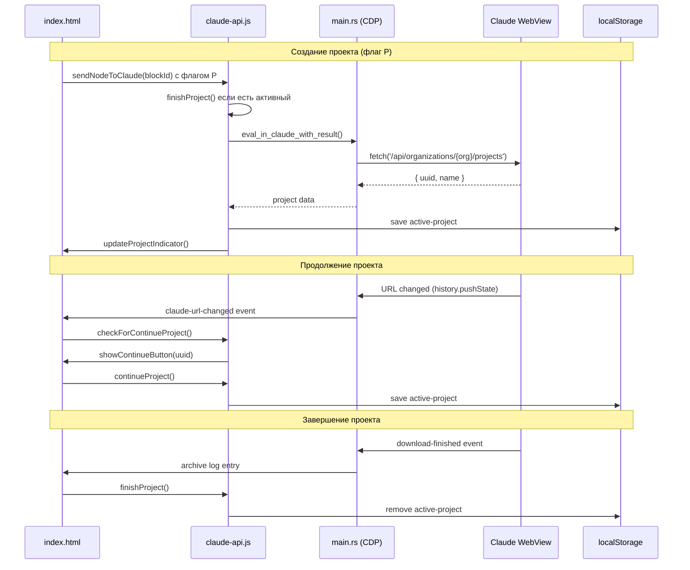

# Интеграция с Claude

[← Назад к INDEX](INDEX.md)

## Поток данных

### Отправка блока в Claude

```
┌─────────────┐     sendNodeToClaude()      ┌─────────────┐
│  index.html │ ──────────────────────────► │ claude-api  │
│  (UI click) │                             │    .js      │
└─────────────┘                             └──────┬──────┘
                                                   │
                    ┌──────────────────────────────┘
                    │ 1. Получить текст блока
                    │ 2. Проверить флаги (P, N)
                    │ 3. Прикрепить файлы
                    ▼
              ┌─────────────┐
              │   Tauri     │
              │  invoke()   │
              └──────┬──────┘
                     │
     ┌───────────────┼───────────────┐
     │               │               │
     ▼               ▼               ▼
┌─────────┐   ┌─────────┐   ┌─────────┐
│insert_  │   │attach_  │   │eval_in_ │
│text_to_ │   │file_to_ │   │claude   │
│claude   │   │claude   │   │         │
└────┬────┘   └────┬────┘   └────┬────┘
     │             │             │
     └──────────┬──┴─────────────┘
                │
                ▼
        ┌─────────────┐
        │   Claude    │
        │   WebView   │
        │ (ProseMirror)│
        └─────────────┘
```

### Создание проекта через API

```
┌─────────────┐     createProjectViaAPI()   ┌─────────────┐
│  claude-api │ ──────────────────────────► │   Tauri     │
│     .js     │                             │   (Rust)    │
└─────────────┘                             └──────┬──────┘
                                                   │
                                                   │ eval_in_claude_with_result()
                                                   │ (CDP: Runtime.evaluate)
                                                   ▼
                                           ┌─────────────┐
                                           │   Claude    │
                                           │   WebView   │
                                           └──────┬──────┘
                                                  │
                                                  │ fetch('/api/organizations/{org}/projects')
                                                  ▼
                                           ┌─────────────┐
                                           │  Claude.ai  │
                                           │    API      │
                                           └──────┬──────┘
                                                  │
                                                  │ { uuid, name }
                                                  ▼
                                           ┌─────────────┐
                                           │ localStorage│
                                           │ active-     │
                                           │ project     │
                                           └─────────────┘
```

---

## Claude Tabs

### Архитектура

Все три таба Claude создаются при старте приложения на `https://claude.ai/new`.
WebView2 не загружает страницу пока webview за пределами экрана, поэтому реальная загрузка происходит при первом показе панели.

### Жизненный цикл

```
Старт приложения
    │
    ├── ensure_claude_webview(1, None)  → claude.ai/new (за экраном)
    ├── ensure_claude_webview(2, None)  → claude.ai/new (за экраном)
    └── ensure_claude_webview(3, None)  → claude.ai/new (за экраном)
    
Первое открытие панели Claude
    │
    └── toggle_claude()
            │
            └── resize_webviews() → webview перемещается в видимую область
                    │
                    └── WebView2 начинает загрузку страницы

Автоматизация (флаги P или N)
    │
    └── waitForClaudeInput() → ожидание загрузки перед действием
```

### Toolbar

Кнопка перезагрузки в toolbar:
- **Одинарный клик** — `location.reload()` (обычная перезагрузка страницы)
- **Двойной клик** — `recreate_claude_tab()` (полное пересоздание webview для зависших табов)

---

## Claude Helpers (claude_helpers.js)

Инжектируемый скрипт для Claude WebView. Передаётся через `get_claude_init_script()` в Rust.

### Селекторы (v4.2.0+)

Селекторы хранятся в **`src-tauri/scripts/selectors.json`** и передаются через `window.__SEL__`:

```javascript
window.__SEL__ = {
    generation: {
        stopButton: [...],           // Кнопки остановки генерации
        streamingIndicator: "...",   // Индикатор стрима
        thinkingIndicator: "..."     // Индикатор "думает"
    },
    input: {
        proseMirror: ".ProseMirror", // Редактор
        sendButton: [...],           // Кнопки отправки
        fileInput: "..."             // Input для файлов
    },
    navigation: {
        leftNav: "...",              // Левый сайдбар
        pinSidebarButton: "...",     // Кнопка pin
        scrollContainer: [...]       // Скролл контейнеры
    },
    project: { ... },
    ui: { ... }
}
```

### Функции поиска элементов

| Функция | Описание |
|---------|----------|
| `__getSel__(path)` | Получить селектор по пути (например `'input.proseMirror'`) |
| `__findEl__(path)` | Поиск элемента по пути с fallback для массивов |
| `__findAll__(path)` | Поиск всех элементов |

### UI функции

| Функция | Описание |
|---------|----------|
| `hideGhostButton()` | Скрытие "призрачной" кнопки (оптимизировано через `:has()`) |
| `setupCombinedObserver()` | Объединённый MutationObserver с debounce |
| `hideSidebar()` | Отключение pointer-events сайдбара |
| `setupSidebarObserver()` | MutationObserver для сайдбара (точечный) |
| `truncateChatTitle()` | CSS-фикс для truncate |
| `initClaudeUI()` | Главная инициализация |

### MutationObserver оптимизация

Для производительности используется объединённый observer с debounce:

```javascript
function setupCombinedObserver() {
    let uiUpdatePending = false;
    
    window.__combinedObserver = new MutationObserver(() => {
        if (uiUpdatePending) return;
        uiUpdatePending = true;
        
        requestAnimationFrame(() => {
            hideGhostButton();
            truncateChatTitle();
            uiUpdatePending = false;
        });
    });
    
    window.__combinedObserver.observe(document.body, { childList: true, subtree: true });
}
```

Это заменяет отдельные `ghostObserver` и `uiObserver`, уменьшая нагрузку на DOM.

### Global Click Listener

```javascript
function setupGlobalClickListener()
```

Закрывает downloads popup при клике в Claude WebView:
- Вызывает `invoke('hide_downloads')` при любом клике
- Устанавливает `window.__globalClickListenerInstalled = true`

### Upload Interceptor

```javascript
function setupUploadInterceptor()
```

Перехватывает `fetch` для отслеживания загрузки:
- `window.__uploadInterceptorInstalled = true`
- `window.__uploadedFilesCount = 0`
- При `/upload-file` увеличивает счётчик

**Session ID защита от race condition:**

При отправке блока с файлами генерируется уникальный `uploadSessionId`:
```javascript
const uploadSessionId = Date.now().toString() + Math.random().toString(36).slice(2);
window.__uploadSessionId = uploadSessionId;
```

Это защищает от ситуации, когда пользователь вручную прикрепляет файл между сбросом счётчика и началом автоматического attach.

**Ограничения:**
- Monkey-patching fetch может конфликтовать с другими interceptors
- Не работает с Service Workers
- Зависит от endpoint `/upload-file` (может измениться)

### URL Change Detection

```javascript
function setupUrlChangeDetection()
```

Отслеживает URL для детекции проекта:
- Перехватывает `history.pushState/replaceState`
- Слушает `popstate`
- Уведомляет Tauri через `notify_url_change`
- Backup проверка каждые 2 сек

### Глобальные переменные

| Переменная | Описание |
|------------|----------|
| `window.__SEL__` | Селекторы |
| `window.__CLAUDE_TAB__` | Номер таба (1-3) |
| `window.__uploadedFilesCount` | Счётчик файлов |
| `window.__uploadInterceptorInstalled` | Флаг |
| `window.__combinedObserver` | Объединённый MutationObserver (ghost + UI) |
| `window.__sidebarObserver` | MutationObserver для сайдбара |
| `window.__urlChangeDetectionInstalled` | Флаг |

---

## Селекторы Claude.ai

**ВАЖНО:** Все селекторы находятся в одном месте — `src-tauri/scripts/selectors.json`:

```json
{
  "generation": {
    "stopButton": ["button[aria-label='Stop Response']", "..."],
    "streamingIndicator": "[data-is-streaming='true']",
    "thinkingIndicator": "[class*='thinking']"
  },
  "input": {
    "proseMirror": ".ProseMirror",
    "sendButton": ["button[aria-label='Send message']", "..."],
    "fileInput": "input[type='file']"
  },
  "navigation": { ... },
  "project": { ... },
  "ui": { ... }
}
```

### Обновление селекторов {#обновление-селекторов}

Claude.ai регулярно обновляет разметку. Вот пошаговая инструкция по исправлению.

#### Шаг 1: Определи проблему

| Симптом | Вероятный селектор |
|---------|-------------------|
| Сайдбар не скрывается | `navigation.leftNav` |
| Отправка не работает | `input.proseMirror`, `input.sendButton` |
| Мониторинг генерации сломан | `generation.*` |
| Ghost button появляется | `ui.ghostButtonIndicator` |

#### Шаг 2: Найди элемент

1. **Запусти приложение** в dev режиме:
   ```bash
   cd src-tauri && cargo tauri dev
   ```

2. **Открой DevTools** в Claude WebView (F12)

3. **Проверь текущие селекторы:**
   ```javascript
   console.log(window.__SEL__);
   document.querySelector(window.__SEL__.input.proseMirror);
   ```

4. **Используй Inspector** (Ctrl+Shift+C) для поиска нового селектора

#### Шаг 3: Создай robust селектор

**Приоритеты (от лучшего к худшему):**

1. **aria-* атрибуты** (самые стабильные)
2. **data-testid атрибуты**
3. **Уникальные классы** (могут меняться)
4. **Структурные пути** (fallback)

#### Шаг 4: Обнови selectors.json

```json
"sendButton": [
  "button[aria-label='Send message']",
  "button[aria-label='Send Message']",
  "button[aria-label='Send']",
  "[data-testid='send-button']"
]
```

#### Шаг 5: Протестируй

```
□ Перезапусти cargo tauri dev
□ Проверь в консоли: window.__SEL__
□ Проверь функциональность
□ Проверь во всех 3 табах Claude
```

### Как работает поиск элементов

```javascript
// claude_helpers.js
function __getSel__(path) {
    const parts = path.split('.');
    let value = window.__SEL__;
    for (const part of parts) {
        value = value?.[part];
    }
    return value;
}

function __findEl__(path) {
    const selectors = __getSel__(path);
    if (!selectors) return null;
    const arr = Array.isArray(selectors) ? selectors : [selectors];
    for (const sel of arr) {
        const el = document.querySelector(sel);
        if (el) return el;
    }
    return null;
}
```

### Текущие селекторы

| Путь | Для чего |
|------|----------|
| `generation.stopButton` | Определение идёт ли генерация |
| `generation.streamingIndicator` | Индикатор потоковой генерации |
| `generation.thinkingIndicator` | Индикатор "думающего" состояния |
| `input.proseMirror` | Редактор сообщений |
| `input.sendButton` | Кнопка отправки |
| `navigation.leftNav` | Левый сайдбар с историей |
| `navigation.scrollContainer` | Скролл контейнер |
| `ui.ghostButtonIndicator` | Невидимая кнопка для скрытия |

→ Полный список в `src-tauri/scripts/selectors.json`

→ Подробная диагностика: [TROUBLESHOOTING-SELECTORS.md](reference/TROUBLESHOOTING-SELECTORS.md)

---

## Project Binding System

Привязка вкладки APM к проекту Claude.

### Диаграмма жизненного цикла



### Lifecycle

1. **Создание** — блок с флагом P → `createProjectViaAPI()`
2. **Привязка** — UUID сохраняется, вкладка APM = владелец
3. **Работа** — кнопки "Чат" скрыты на других вкладках
4. **Завершение** — скачивание архива → привязка снимается

### API функции (claude-api.js)

| Функция | Описание |
|---------|----------|
| `getOrganizationId(tab)` | Получение org_id (кэш) |
| `invalidateOrgCache()` | Сброс кэша |
| `createProjectViaAPI(tab)` | Создание проекта |
| `createNewProject(tab)` | Создание с UI |
| `generateProjectName()` | Генерация имени |

### Кэширование Organization ID

`getOrganizationId()` кэширует org_id после первого получения в `cachedOrgId`.

**Инвалидация кэша:**
- При навигации на `/login`, `/logout`, `/sign` (смена аккаунта)
- При вызове `invalidateOrgCache()` напрямую
- При перезапуске приложения (через `restoreClaudeState()`)

```javascript
// В claude-url-changed listener:
if (url.includes('/login') || url.includes('/logout') || url.includes('/sign')) {
    invalidateOrgCache();
}
```

**Важно:** Без инвалидации при смене аккаунта проект будет создан в организации старого аккаунта.

### Продолжение проекта

При открытии страницы проекта появляется кнопка "Продолжить проект":

| Функция | Описание |
|---------|----------|
| `checkForContinueProject()` | Автопроверка URL |
| `continueProject()` | Привязка к проекту |
| `initProjectUrlTracking()` | Отслеживание URL |
| `showContinueButton(uuid)` | Показ кнопки |
| `hideContinueButton()` | Скрытие кнопки |

### Хранение

- **localStorage:** `active-project` → `{ uuid, name, ownerTab }`
- При переключении вкладок проверяется `ownerTab`

---

## Встроенные скрипты

Python-скрипты для прикрепления к блокам:

### convert.py

Markdown → HTML:
- Заголовки, списки, таблицы, код
- Якоря: `## Заголовок {#my-anchor}`
- Автоопределение языка
- Два режима: с шаблоном и standalone

### count.py

Подсчёт слов в Markdown:
- Только видимый текст
- Убирает разметку

### spellcheck.py

Проверка текста:
- Орфография через hunspell
- Поиск смешанных алфавитов
- Баланс парной пунктуации

---

## Автоматизации блоков

Флаги в контекстном меню:

**P (New Project)**
- Завершает текущий проект
- Создаёт новый
- Привязывает к вкладке

**N (New Chat)**
- Открывает чистый чат
- Перед отправкой блока

---

## Wait Utilities

| Функция | Описание |
|---------|----------|
| `waitForTabLoad(tab, timeoutMs)` | Загрузка страницы |
| `waitForClaudeInput(tab, timeout)` | ProseMirror editor |
| `waitForFileInput(tab, timeout)` | File input |
| `waitForFilesUploaded(tab, expectedCount, timeout)` | Все файлы |

---

## Project Lifecycle Functions

Полный цикл работы с проектами:

| Функция | Описание |
|---------|----------|
| `getProjectUUIDFromUrl(url)` | Извлечение UUID из URL проекта |
| `startProject(uuid, name, ownerTab)` | Начало работы с проектом |
| `finishProject()` | Завершение проекта (снятие привязки) |
| `continueProject()` | Продолжение найденного проекта |
| `checkForContinueProject()` | Автопроверка URL на проект |
| `showContinueButton(uuid)` | Показ кнопки "Продолжить" |
| `hideContinueButton()` | Скрытие кнопки |
| `restoreProjectState()` | Восстановление из localStorage |
| `initProjectUrlTracking()` | Запуск отслеживания URL |

---

## Связанные документы

- [02-FRONTEND.md](02-FRONTEND.md) — JS модули
- [03-BACKEND.md](03-BACKEND.md) — Tauri commands, **[CDP Timeouts](03-BACKEND.md#cdp-timeouts)**
- [05-FEATURES.md](05-FEATURES.md) — Функции
- [reference/TROUBLESHOOTING-SELECTORS.md](reference/TROUBLESHOOTING-SELECTORS.md) — Диагностика селекторов
