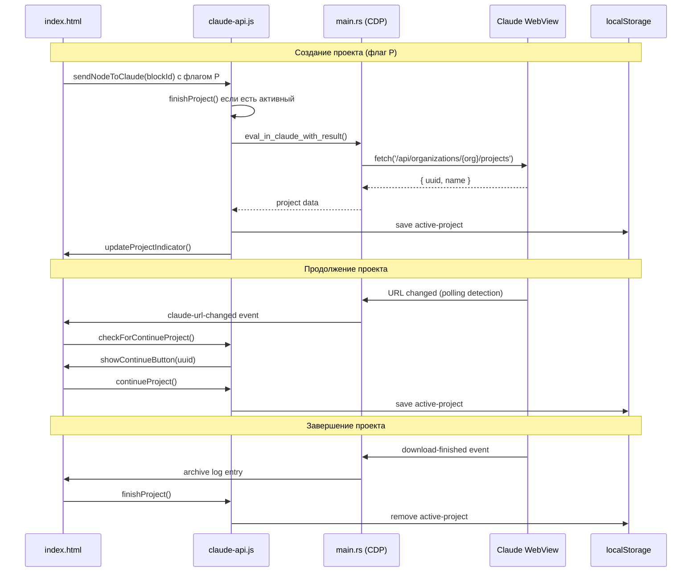

# Интеграция с Claude

[← Назад к INDEX](INDEX.md)

## Поток данных

### Отправка блока в Claude

```
┌─────────────┐     sendNodeToClaude()      ┌─────────────┐
│  index.html │ ──────────────────────────► │ claude-api  │
│  (UI click) │                             │    .js      │
└─────────────┘                             └──────┬──────┘
                                                   │
                    ┌──────────────────────────────┘
                    │ 1. Получить текст блока
                    │ 2. Проверить флаги (P, N)
                    │ 3. Прикрепить файлы
                    ▼
              ┌─────────────┐
              │   Tauri     │
              │  invoke()   │
              └──────┬──────┘
                     │
     ┌───────────────┼───────────────┐
     │               │               │
     ▼               ▼               ▼
┌─────────┐   ┌─────────┐   ┌─────────┐
│insert_  │   │attach_  │   │eval_in_ │
│text_to_ │   │file_to_ │   │claude   │
│claude   │   │claude   │   │         │
└────┬────┘   └────┬────┘   └────┬────┘
     │             │             │
     └──────────┬──┴─────────────┘
                │
                ▼
        ┌─────────────┐
        │   Claude    │
        │   WebView   │
        │ (ProseMirror)│
        └─────────────┘
```

### Создание проекта через API

```
┌─────────────┐     createProjectViaAPI()   ┌─────────────┐
│  claude-api │ ──────────────────────────► │   Tauri     │
│     .js     │                             │   (Rust)    │
└─────────────┘                             └──────┬──────┘
                                                   │
                                                   │ eval_in_claude_with_result()
                                                   │ (CDP: Runtime.evaluate)
                                                   ▼
                                           ┌─────────────┐
                                           │   Claude    │
                                           │   WebView   │
                                           └──────┬──────┘
                                                  │
                                                  │ fetch('/api/organizations/{org}/projects')
                                                  ▼
                                           ┌─────────────┐
                                           │  Claude.ai  │
                                           │    API      │
                                           └──────┬──────┘
                                                  │
                                                  │ { uuid, name }
                                                  ▼
                                           ┌─────────────┐
                                           │ localStorage│
                                           │ active-     │
                                           │ project     │
                                           └─────────────┘
```

---

## Claude Tabs

### Архитектура

Все три таба Claude создаются при старте приложения на `https://claude.ai/new`.
При создании — позиционируются за экран (`set_position(width*2, 0)`) + `hide()`. При открытии панели активный таб показывается через `show()` + `set_position`, неактивные остаются за экраном (offscreen, IsVisible=TRUE — DOM живой, timers работают, `history.replaceState` обновляется). При скрытии панели — `hide()` на всех табах для экономии CPU. Suspend отключён: `TrySuspend()` замораживал DOM и ломал querySelector/insertContent на фоновых табах.

### Жизненный цикл

```
Старт приложения (async)
    │
    ├── create_claude_webview(1)  → claude.ai/new + offscreen(width*2, 0) + hide()
    ├── create_claude_webview(2)  → claude.ai/new + offscreen(width*2, 0) + hide()
    ├── create_claude_webview(3)  → claude.ai/new + offscreen(width*2, 0) + hide()
    ├── ensure_toolbar()          → toolbar + downloads + hide()
    ├── raise_toolbar_zorder()    → SetWindowPos(HWND_TOP)
    
Первое открытие панели Claude
    │
    └── toggle_claude()
            │
            ├── resize_webviews() → активный таб: show() + set_position, toolbar: show()

Переключение табов
    │
    └── switch_claude_tab(new)
            │
            └── resize_webviews()         → show(new) + set_position, offscreen(prev)

Скрытие панели Claude
    │
    └── toggle_claude()
            │
            ├── resize_webviews() → hide() все табы, toolbar, downloads
```

### Toolbar

Кнопка перезагрузки в toolbar:
- **Одинарный клик** — `location.reload()` (обычная перезагрузка страницы)
- **Двойной клик** — `recreate_claude_tab()` (полное пересоздание webview для зависших табов)

---

## Claude Helpers (claude_helpers.js)

Инжектируемый скрипт для Claude WebView. Передаётся через `get_claude_init_script()` в Rust.

### Селекторы (v4.2.0+)

Селекторы хранятся в **`src-tauri/scripts/selectors.json`** и передаются через `window._s`:

```javascript
window._s = {
    generation: {
        stopButton: [...],           // Кнопки остановки генерации
        streamingIndicator: "...",   // Индикатор стрима
        thinkingIndicator: "..."     // Индикатор "думает"
    },
    input: {
        proseMirror: ".ProseMirror", // Редактор
        contentEditable: "...",      // Fallback: [contenteditable='true']
        textarea: "...",             // Fallback: textarea
        sendButton: [...],           // Кнопки отправки
        fileInput: "..."             // Input для файлов
    },
    attachments: {
        attachButtonAriaPattern: "..." // Паттерн aria-label для кнопки прикрепления
    },
    navigation: {
        leftNav: "...",              // Левый сайдбар
        pinSidebarButton: "...",     // Кнопка pin
        scrollContainer: [...]       // Скролл контейнеры
    },
    project: {
        projectLinkInHeader: "...",  // Ссылка на проект в шапке
        projectLinkGeneric: "...",   // Общая ссылка на проект
        pageTitle: "..."             // Заголовок страницы (h1)
    },
    ui: {
        ghostButtonIndicator: "...", // Невидимая кнопка для скрытия
        titleContainer: "...",       // Контейнер заголовка чата
        artifactControls: "..."      // Контролы артефактов
    }
}
```

### Функции поиска элементов

| Функция | Описание |
|---------|----------|
| `__getSel__(path)` | Получить селектор по пути (например `'input.proseMirror'`) |
| `__findEl__(path)` | Поиск элемента по пути с fallback для массивов |
| `__findAll__(path)` | Поиск всех элементов |
| `__findElSmart__(path)` | Умный поиск с эвристическим fallback и диагностикой |
| `__logSelectorFallback__(path)` | Логирование использования fallback-селектора в диагностику |

### Диагностика

| Функция | Описание |
|---------|----------|
| `runSelectorHealthCheck()` | Проверка работоспособности всех селекторов при загрузке |

### UI функции

| Функция | Описание |
|---------|----------|
| `hideGhostButton()` | Скрытие "призрачной" кнопки (оптимизировано через `:has()`) |
| `setupCombinedObserver()` | Объединённый MutationObserver с debounce |
| `hideSidebar()` | Отключение pointer-events сайдбара |
| `setupSidebarObserver()` | MutationObserver для сайдбара (точечный) |
| `truncateChatTitle()` | CSS-фикс для truncate |
| `initClaudeUI()` | Главная инициализация |

### MutationObserver оптимизация

Для производительности используется объединённый observer с debounce:

```javascript
function setupCombinedObserver() {
    let uiUpdatePending = false;
    
    window._o2 = new MutationObserver(() => {
        if (uiUpdatePending) return;
        uiUpdatePending = true;
        
        requestAnimationFrame(() => {
            hideGhostButton();
            truncateChatTitle();
            uiUpdatePending = false;
        });
    });
    
    window._o2.observe(document.body, { childList: true, subtree: true });
}
```

Это заменяет отдельные `ghostObserver` и `uiObserver`, уменьшая нагрузку на DOM.

### Global Click Listener

```javascript
function setupGlobalClickListener()
```

Закрывает downloads popup при клике в Claude WebView:
- Вызывает `invoke('hide_downloads')` при любом клике
- Устанавливает `window.__globalClickListenerInstalled = true`

### Generation Monitor

```javascript
Мониторинг генерации встроен в initClaudeUI()
```

Мониторинг генерации через DOM-наблюдение (без monkey-patching):
- `window._g0 = true`
- Проверяет наличие stop button, streaming indicator, thinking indicator
- `setInterval` каждые 300мс
- Обновляет URL hash через `history.replaceState("#generating")`

Подсчёт загрузок файлов — только на стороне Rust (WebResourceRequested).

Для фоновых суспендированных табов используется Rust CDP polling
Rust читает `webview.url()` — синхронно, без CDP. JS polling каждые 500мс через `check_generation_status`.

### URL Change Detection

```javascript
function setupUrlChangeDetection()
```

Отслеживает URL для детекции проекта:
- Слушает `popstate` (back/forward)
- Polling `location.href` каждые 2 сек
- Уведомляет Tauri через `notify_url_change`

### Глобальные переменные

| Переменная | Описание |
|------------|----------|
| `window._s` | Селекторы |
| `window._t` | Номер таба (1-3) |
| `window._g0` | Флаг мониторинга генерации |
| `window._g1` | Интервал мониторинга генерации |
| `window._o2` | Объединённый MutationObserver (ghost + UI) |
| `window._o1` | MutationObserver для сайдбара |
| `window._d0` | Флаг |
| `window._d1` | Интервал отслеживания URL (checkUrlChange) |
| `window._c0` | Флаг инициализации |
| `window._u0` | Интервал UI-обновлений (hideSidebar, truncateChatTitle) |
| `window._inv` | Кэшированный `__TAURI__.core.invoke` (оригинал удаляется) |
| `window._emit` | Кэшированный `__TAURI__.event.emit` (для toast из Claude WebView) |
| `window._ac` | Auto-Continue: `enabled`, `setEnabled(bool)`, `_timer`, `_pending` |

---

## Селекторы Claude.ai

**ВАЖНО:** Все селекторы находятся в одном месте — `src-tauri/scripts/selectors.json`:

```json
{
  "generation": {
    "stopButton": ["button[aria-label='Stop Response']", "..."],
    "streamingIndicator": "[data-is-streaming='true']",
    "thinkingIndicator": "[class*='thinking']"
  },
  "input": {
    "proseMirror": ".ProseMirror",
    "sendButton": ["button[aria-label='Send message']", "..."],
    "fileInput": "input[type='file']"
  },
  "attachments": {
    "attachButtonAriaPattern": "attach"
  },
  "navigation": { ... },
  "project": { ... },
  "ui": { ... }
}
```

### Обновление селекторов {#обновление-селекторов}

Claude.ai регулярно обновляет разметку. Вот пошаговая инструкция по исправлению.

#### Шаг 1: Определи проблему

| Симптом | Вероятный селектор |
|---------|-------------------|
| Сайдбар не скрывается | `navigation.leftNav` |
| Отправка не работает | `input.proseMirror`, `input.sendButton` |
| Мониторинг генерации сломан | `generation.*` |
| Ghost button появляется | `ui.ghostButtonIndicator` |

#### Шаг 2: Найди элемент

1. **Запусти приложение** в dev режиме:
   ```bash
   cd src-tauri && cargo tauri dev
   ```

2. **Открой DevTools** в Claude WebView (F12)

3. **Проверь текущие селекторы:**
   ```javascript
   console.log(window._s);
   document.querySelector(window._s.input.proseMirror);
   ```

4. **Используй Inspector** (Ctrl+Shift+C) для поиска нового селектора

#### Шаг 3: Создай robust селектор

**Приоритеты (от лучшего к худшему):**

1. **aria-* атрибуты** (самые стабильные)
2. **data-testid атрибуты**
3. **Уникальные классы** (могут меняться)
4. **Структурные пути** (fallback)

#### Шаг 4: Обнови selectors.json

```json
"sendButton": [
  "button[aria-label='Send message']",
  "button[aria-label='Send Message']",
  "button[aria-label='Send']",
  "[data-testid='send-button']"
]
```

#### Шаг 5: Протестируй

```
□ Перезапусти cargo tauri dev
□ Проверь в консоли: window._s
□ Проверь функциональность
□ Проверь во всех 3 табах Claude
```

### Как работает поиск элементов

```javascript
// claude_helpers.js
function __getSel__(path) {
    const parts = path.split('.');
    let value = window._s;
    for (const part of parts) {
        value = value?.[part];
    }
    return value;
}

function __findEl__(path) {
    const selectors = __getSel__(path);
    if (!selectors) return null;
    const arr = Array.isArray(selectors) ? selectors : [selectors];
    for (const sel of arr) {
        const el = document.querySelector(sel);
        if (el) return el;
    }
    return null;
}
```

### Текущие селекторы

| Путь | Для чего |
|------|----------|
| `generation.stopButton` | Определение идёт ли генерация |
| `generation.streamingIndicator` | Индикатор потоковой генерации |
| `generation.thinkingIndicator` | Индикатор "думающего" состояния |
| `input.proseMirror` | Редактор сообщений |
| `input.contentEditable` | Fallback: любой contenteditable элемент |
| `input.textarea` | Fallback: textarea |
| `input.sendButton` | Кнопка отправки |
| `input.fileInput` | Input для загрузки файлов |
| `attachments.attachButtonAriaPattern` | Паттерн aria-label кнопки прикрепления |
| `navigation.leftNav` | Левый сайдбар с историей |
| `navigation.pinSidebarButton` | Кнопка pin сайдбара |
| `navigation.scrollContainer` | Скролл контейнер |
| `project.projectLinkInHeader` | Ссылка на проект в шапке чата |
| `project.projectLinkGeneric` | Общая ссылка на проект |
| `project.pageTitle` | Заголовок страницы (h1) |
| `ui.ghostButtonIndicator` | Невидимая кнопка для скрытия |
| `ui.titleContainer` | Контейнер заголовка чата |
| `ui.artifactControls` | Контролы артефактов |

→ Полный список в `src-tauri/scripts/selectors.json`

→ Подробная диагностика: [TROUBLESHOOTING-SELECTORS.md](reference/TROUBLESHOOTING-SELECTORS.md)

---

## Project Binding System

Привязка вкладки APM к проекту Claude.

### Диаграмма жизненного цикла


```mermaid
sequenceDiagram
    participant UI as index.html
    participant API as claude-api.js
    participant Tauri as main.rs (CDP)
    participant Claude as Claude WebView
    participant Storage as localStorage

    Note over UI,Storage: Создание проекта (флаг P)
    UI->>API: sendNodeToClaude(blockId) с флагом P
    API->>API: finishProject() если есть активный
    API->>Tauri: eval_in_claude_with_result()
    Tauri->>Claude: fetch('/api/organizations/{org}/projects')
    Claude-->>Tauri: { uuid, name }
    Tauri-->>API: project data
    API->>Storage: save active-project
    API->>UI: updateProjectIndicator()

    Note over UI,Storage: Продолжение проекта
    Claude->>Tauri: URL changed (polling detection)
    Tauri->>UI: claude-url-changed event
    UI->>API: checkForContinueProject()
    API->>UI: showContinueButton(uuid)
    UI->>API: continueProject()
    API->>Storage: save active-project

    Note over UI,Storage: Завершение проекта
    Claude->>Tauri: download-finished event
    Tauri->>UI: archive log entry
    UI->>API: finishProject()
    API->>Storage: remove active-project
```

### Lifecycle

1. **Создание** — блок с флагом P → `createProjectViaAPI()`
2. **Привязка** — UUID сохраняется, вкладка APM = владелец
3. **Работа** — кнопки "Чат" скрыты на других вкладках
4. **Завершение** — скачивание архива → привязка снимается

### API функции (claude-api.js)

| Функция | Описание |
|---------|----------|
| `getOrganizationId(tab)` | Получение org_id (кэш) |
| `invalidateOrgCache()` | Сброс кэша |
| `createProjectViaAPI(tab)` | Создание проекта |
| `createNewProject(tab)` | Создание с UI |
| `generateProjectName()` | Генерация имени |

### Кэширование Organization ID

`getOrganizationId()` кэширует org_id после первого получения в `cachedOrgId`.

**Инвалидация кэша:**
- При навигации на `/login`, `/logout`, `/sign` (смена аккаунта)
- При вызове `invalidateOrgCache()` напрямую
- При перезапуске приложения (через `restoreClaudeState()`)

```javascript
// В claude-url-changed listener:
if (url.includes('/login') || url.includes('/logout') || url.includes('/sign')) {
    invalidateOrgCache();
}
```

**Важно:** Без инвалидации при смене аккаунта проект будет создан в организации старого аккаунта.

### Продолжение проекта

При открытии страницы проекта появляется кнопка "Продолжить проект":

| Функция | Описание |
|---------|----------|
| `checkForContinueProject()` | Автопроверка URL |
| `continueProject()` | Привязка к проекту |
| `initProjectUrlTracking()` | Отслеживание URL |
| `showContinueButton(uuid)` | Показ кнопки |
| `hideContinueButton()` | Скрытие кнопки |

### Хранение

- **localStorage:** `active-project` → `{ uuid, name, ownerTab }`
- При переключении вкладок проверяется `ownerTab`

---

## Встроенные скрипты

Python-скрипты для прикрепления к блокам:

### convert.py

HTML-merge: content.html + design.html → index.html:
- Мерж innerHTML каждого `data-content` блока из content в design
- 5 пост-мерж шагов: фикс структур, конвертация атрибутов, FAQ→details, restore preserved, семантические атрибуты
- Валидация дубликатов data-content id
- Pre-merge и post-merge диагностика

### count.py

Подсчёт слов в Markdown и HTML:
- Только видимый текст
- Убирает разметку

## Автоматизации блоков

Флаги в контекстном меню:

**P (New Project)**
- Завершает текущий проект
- Создаёт новый
- Привязывает к вкладке

**N (New Chat)**
- Открывает чистый чат
- Перед отправкой блока

---

## Wait Utilities

| Функция | Описание |
|---------|----------|
| `waitForTabLoad(tab, timeoutMs)` | Загрузка страницы |
| `waitForClaudeInput(tab, timeout)` | ProseMirror editor |
| `waitForFileInput(tab, timeout)` | File input |
| `waitForFilesUploaded(tab, expectedCount, timeout)` | Все файлы |

---

## Project Lifecycle Functions

Полный цикл работы с проектами:

| Функция | Описание |
|---------|----------|
| `getProjectUUIDFromUrl(url)` | Извлечение UUID из URL проекта |
| `startProject(uuid, name, ownerTab)` | Начало работы с проектом |
| `finishProject()` | Завершение проекта (снятие привязки) |
| `continueProject()` | Продолжение найденного проекта |
| `checkForContinueProject()` | Автопроверка URL на проект |
| `showContinueButton(uuid)` | Показ кнопки "Продолжить" |
| `hideContinueButton()` | Скрытие кнопки |
| `restoreProjectState()` | Восстановление из localStorage |
| `initProjectUrlTracking()` | Запуск отслеживания URL |

---

## Claude Counter (v4.4.0+)

Встроенный таймер кэша и usage bars. Переписан из расширения Claude Counter v0.4.2 для WebView2 без monkey-patching.

### Архитектура

```
┌─────────────────────────────────────────┐
│ Claude WebView (инжекция при старте)    │
├─────────────────────────────────────────┤
│  claude_counter.css (style element)     │
│  claude_counter.js  (main logic)        │
└───────────┬─────────────────────────────┘
            │ прямой fetch (credentials: include)
            ▼
    /api/organizations/{orgId}/usage
    /api/organizations/{orgId}/chat_conversations/{id}?tree=true
```

### Компоненты

| Компонент | Описание |
|-----------|----------|
| **Cache timer** | Обратный отсчёт 5-мин окна кэширования после ответа Claude |
| **Session bar** | 5-часовое окно использования с progress bar и маркером позиции |
| **Weekly bar** | 7-дневное окно использования с progress bar и маркером позиции |

### Безопасность (без monkey-patching)

| Оригинальный плагин | APM реализация |
|---------------------|----------------|
| Патчит `window.fetch` | Прямой `fetch()` к API |
| Патчит `history.pushState/replaceState` | `popstate` + polling 1.5 сек |
| Перехватывает SSE event-stream | Refresh usage при окончании генерации (URL hash) |
| Bridge pattern (postMessage) | Не нужен — единый контекст WebView2 |

### Файлы

| Файл | Размер | Описание |
|------|--------|----------|
| `scripts/claude_counter.js` | ~27KB | Основная логика (constants + conversation + UI + main) |
| `scripts/claude_counter.css` | ~2KB | Стили баров, тултипов, layout |

---

## Knowledge Upload (v4.4.0+)

Автоматическая загрузка скачанных MD-файлов в knowledge активного проекта.

### Поток

```
download-finished (filename.md)
    │
    ├── filename.endsWith('.md')? ──нет──→ пропуск
    │
    ├── isProjectActive()? ──нет──→ пропуск
    │
    ▼
uploadToProjectKnowledge(filePath, filename)
    │
    ├── read_file_for_attachment (Rust) → base64
    │
    ├── CDP eval: fetch POST /api/.../projects/{uuid}/docs
    │   (JSON: { file_name, content })
    │
    ├── Toast: "📎 file.md → knowledge"
    │
    └── delete_download (Rust) — удаление файла с диска
```

### API функции

| Функция | Файл | Описание |
|---------|------|----------|
| `uploadToProjectKnowledge(filePath, filename)` | claude-api.js | Загрузка файла в knowledge через Claude API |

---

## Auto-Continue (v4.4.0+)

Автоматическое продолжение при достижении tool-use limit. Адаптация [claude-autocontinue](https://github.com/timothy22000/claude-autocontinue) (MIT) для WebView2.

### Архитектура

```
┌─────────────────────────────────────────┐
│ Claude WebView (инжекция при старте)    │
├─────────────────────────────────────────┤
│  claude_autocontinue.js                 │
│  window._ac.setEnabled(true/false)      │
└───────────┬─────────────────────────────┘
            │ poll каждые 2-4s (jitter)
            ▼
    detectToolUseLimit()
    ├── Gate 1: видимая кнопка "Continue"
    └── Gate 2: фраза tool-use limit
                в последнем сообщении
            │
            │ задержка 1.5-3s (jitter)
            ▼
    button.click() → emit('auto-continue-toast')
                          │
                          ▼
                  Main WebView → showToast()
```

### Детекция (двухступенчатая)

Автоклик срабатывает **только** когда оба условия истинны:

1. В DOM есть **видимая** кнопка с текстом «Continue»
2. В **последнем** сообщении ассистента найдена одна из фраз: `tool-use limit`, `tool use limit`, `reached its tool`, `exhausted the tool`, `tool call limit`, `continuation needed`

Если Claude закончил работу и выдал файл — кнопка Continue может появиться, но фразы про tool-use limit **не будет**. Ложного срабатывания не произойдёт.

### Антибот

| Механизм | Реализация |
|----------|------------|
| Задержка перед кликом | 1.5-3 сек (рандом) |
| Интервал поллинга | 2-4 сек (рандом, не ровный setInterval) |
| Повторная проверка | Перед кликом проверяет что кнопка ещё видна |
| Клик | `button.click()` — тот же способ, что APM использует для sendButton |
| Monkey-patching | Нет — ни fetch, ни history, ни DOM |

### Настройка

Тогл в **Настройки → Дополнительно → Auto-continue**. По умолчанию включён. Состояние хранится в `settings.autoContinue` (localStorage). При включении синхронизируется во все 3 Claude таба через `evalInClaude`.

### Глобальные переменные

| Переменная | Описание |
|------------|----------|
| `window._ac` | Объект auto-continue (enabled, setEnabled) |
| `window._emit` | Кэшированный `__TAURI__.event.emit` (для toast) |

### Файлы

| Файл | Описание |
|------|----------|
| `scripts/claude_autocontinue.js` | Инжектируемый скрипт (~137 строк) |
| `settings.js` | `setAutoContinue()`, `syncAutoContinueToWebViews()` |
| `init.js` | Click handlers + toast listener |

---

## Связанные документы

- [02-FRONTEND.md](02-FRONTEND.md) — JS модули
- [03-BACKEND.md](03-BACKEND.md) — Tauri commands, **[CDP Timeouts](03-BACKEND.md#cdp-timeouts)**
- [05-FEATURES.md](05-FEATURES.md) — Функции
- [reference/TROUBLESHOOTING-SELECTORS.md](reference/TROUBLESHOOTING-SELECTORS.md) — Диагностика селекторов
