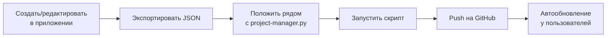

# Workflow: Работа с промптами

[← Назад к INDEX](../INDEX.md)

Пошаговый гайд по созданию, редактированию и публикации промптов.

---

## Обзор процесса



---

## 1. Создание новой вкладки промптов

### В приложении

1. **Создать вкладку:**
   - Кликни "+" в списке вкладок
   - Введи название (например, "BET-PILLAR")

2. **Добавить блоки:**
   - Кликни "Добавить блок" или используй контекстное меню
   - Заполни заголовок и текст промпта

3. **Настроить автоматизации (опционально):**
   - ПКМ по блоку → Автоматизация
   - Флаг **P** — создаёт новый проект Claude
   - Флаг **N** — создаёт новый чат

4. **Добавить инструкции (опционально):**
   - ПКМ по блоку → Добавить инструкцию
   - **Input** — поля для замены текста
   - **Info** — информационная кнопка

5. **Прикрепить скрипты (опционально):**
   - ПКМ по блоку → Прикрепить скрипт
   - `convert` — конвертация MD → HTML
   - `count` — подсчёт слов
   - `spellcheck` — проверка орфографии

### Настройка Workflow

1. **Переключиться в Edit Mode** (переключатель в настройках)
2. **Расположить блоки** на canvas drag & drop
3. **Создать связи** между блоками:
   - Начни drag с порта (точка на границе)
   - Тяни к порту другого блока
4. **Zoom:** Ctrl+Scroll
5. **Pan:** Средняя кнопка мыши или Space+Drag

---

## 2. Экспорт вкладки

1. Открой **Настройки** (иконка шестерёнки)
2. Выбери **Экспорт вкладки**
3. Сохрани JSON-файл

### Структура экспортированного файла

```json
{
  "version": 2,
  "exportDate": "2026-01-26T09:21:58.435Z",
  "tab": {
    "id": "bet-pillar",
    "name": "BET-PILLAR",
    "order": 1,
    "version": "1.0.27",
    "items": [
      {
        "type": "block",
        "id": "item_123...",
        "title": "Контент-план",
        "content": "Текст промпта...",
        "instruction": { ... },
        "automation": { "newProject": true },
        "scripts": ["count"]
      }
    ]
  },
  "workflow": {
    "positions": { "item_123...": { "x": 100, "y": 200 } },
    "sizes": { "item_123...": { "width": 680, "height": 500 } },
    "connections": [
      { "from": "item_123...", "fromSide": "bottom", "to": "item_456...", "toSide": "top" }
    ]
  }
}
```

---

## 3. Публикация на GitHub

### Подготовка

1. **Положи JSON-файл рядом с `project-manager.py`**
   ```
   ai-prompts-manager/
   ├── project-manager.py
   ├── bet-pillar.json      ← сюда
   └── ...
   ```

2. **Убедись, что настроен GitHub Token:**
   - Файл `.env` с `GITHUB_TOKEN=ghp_...`
   - Или переменная окружения

### Push через скрипт

```bash
python project-manager.py
```

1. Скрипт покажет файлы к пушу:
   ```
   📁 JSON файлов к пушу: 1
       - bet-pillar.json
   ```

2. Выбери **"Push"** → подтверди

3. **Что происходит:**
   - Автоинкремент версии вкладки (patch)
   - Обновление `prompts/manifest.json`
   - Push на GitHub
   - Удаление локального JSON

---

## 4. Обновление существующей вкладки

1. **Отредактируй вкладку** в приложении
2. **Экспортируй** с тем же ID
3. **Push** через скрипт — версия автоматически увеличится

> **Важно:** ID вкладки (slug от имени) должен совпадать с существующей на GitHub.

---

## 5. Переименование/удаление вкладки

```bash
python project-manager.py
# Выбери "Промпты" → "Переименовать вкладку" или "Удалить вкладку"
```

---

## 6. Изменение порядка вкладок

```bash
python project-manager.py
# Выбери "Промпты" → "Изменить порядок вкладок"
```

```
Текущий порядок:
  1. BET-PILLAR
  2. BET-CLUSTERS
  3. CONTENT-PLAN

Новый порядок: 2 1 3
```

Результат: BET-CLUSTERS, BET-PILLAR, CONTENT-PLAN

---

## Пример: Полный цикл

### Сценарий: Создание вкладки "SEO-AUDIT"

```bash
# 1. В приложении создаём вкладку и блоки
#    Экспортируем как seo-audit.json

# 2. Копируем файл
cp ~/Downloads/seo-audit.json ./

# 3. Запускаем скрипт
python project-manager.py

# 4. Видим:
#    📁 JSON файлов к пушу: 1
#        - seo-audit.json

# 5. Выбираем "Push" → "Да"

# 6. Результат:
#    ✅ Файлы успешно загружены
#    Удалено: seo-audit.json
```

### Проверка

1. Открой `https://github.com/IllWicked/ai-prompts-manager/tree/main/prompts`
2. Убедись, что `seo-audit.json` и обновлённый `manifest.json` там

---

## Структура промптов на GitHub

```
prompts/
├── manifest.json           # Манифест с версиями
├── bet-pillar.json         # Вкладка 1
├── bet-clusters.json       # Вкладка 2
└── seo-audit.json          # Вкладка 3
```

### manifest.json

```json
{
  "version": "1.5.0",
  "updated": "2026-01-27",
  "release_notes": "Добавлена вкладка SEO-AUDIT",
  "tabs": {
    "bet-pillar": {
      "name": "BET-PILLAR",
      "version": "1.0.28",
      "order": 1,
      "file": "bet-pillar.json"
    },
    "seo-audit": {
      "name": "SEO-AUDIT",
      "version": "1.0.0",
      "order": 2,
      "file": "seo-audit.json"
    }
  }
}
```

---

## Автообновление у пользователей

После push:
1. Приложение проверяет `manifest.json` при запуске
2. Сравнивает версии локальных и удалённых вкладок
3. Показывает уведомление о новых промптах
4. Пользователь применяет обновление

> **Кастомные вкладки** (созданные пользователем локально) **не перезаписываются**.

---

## Troubleshooting

### "Нечего загружать"

JSON-файлы должны лежать **рядом со скриптом**, не в подпапках.

### "Ошибка 401 Unauthorized"

Проверь GitHub Token:
```bash
# Файл .env
GITHUB_TOKEN=ghp_xxxxxxxxxxxxxxxxxxxx
```

### Вкладка не обновляется у пользователей

1. Проверь, что push прошёл успешно
2. Проверь `manifest.json` на GitHub — версия должна увеличиться
3. Пользователь должен нажать "Проверить обновления промптов"

---

## Связанные документы

- [PROJECT-MANAGER.md](../reference/PROJECT-MANAGER.md) — Подробнее о скрипте
- [SETUP_GITHUB.md](SETUP_GITHUB.md) — Настройка GitHub и токена
- [frontend/DATA-STRUCTURES.md](../frontend/DATA-STRUCTURES.md) — Структура данных вкладки
